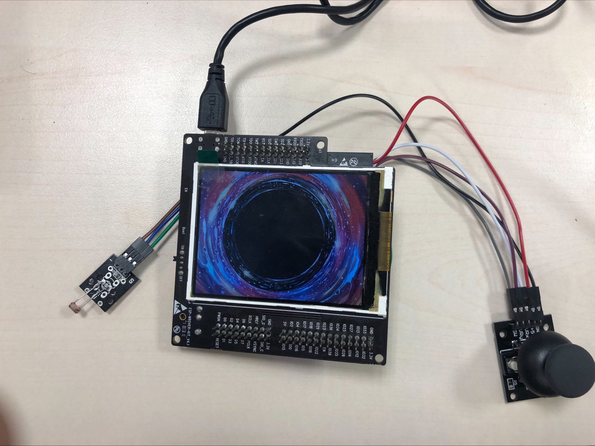

# Image-Display-ESP32-WROVER-KIT_V4.1

## A PCTO project developed on ESP32 by Alessio Anceschi &amp; Leonardo Montecchi at Re:Lab

### Components:

- [ESP32-WROVER-KIT_V4.1](https://docs.espressif.com/projects/esp-idf/en/latest/esp32/hw-reference/esp32/get-started-wrover-kit.html)
- [Photoresistor](https://arduinomodules.info/ky-018-photoresistor-module/)
- [Joystick Module](https://it.aliexpress.com/i/32993873615.html)
- [Jumpers x8](https://www.amazon.com/GenBasic-Piece-Female-Jumper-Wires/dp/B01L5ULRUAl)

### Project Description:
This is a project developed for an [ESP32-WROVER-KIT_V4.1](https://docs.espressif.com/projects/esp-idf/en/latest/esp32/hw-reference/esp32/get-started-wrover-kit.html) in which we use its display to draw various images that are on the SPIFFS memory of the ESP32. The ESP32 also opens a Web Server at the IP that is written on the display that also shows the current image and allows the user to go to the previous or next one. From the Web Server it is possible to upload images to the ESP32 or delete them. Finally on the Web Server the "Change WiFi" button allows the User to make the ESP switch to another WiFi Network if requested.

The ESP is connected to a photoresistor breakout board(KY-018) and a joystick module. The photoresistor sends data to the ESP32 which then regulates the brightness of the screen accordingly(When it's dark it brightens and when it's bright it darkens). The joystick module allows for easy image switching; by moving the stick up, down, left or right new images are displayed.

### Development Platform
The project was developed using [Visual Studio Code](https://code.visualstudio.com/) extension "PlatformIO" to upload and debug ESP32 Code.

21/06/2023